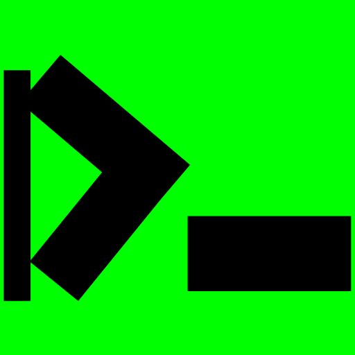

<p align="center">
  
</p>

# Prizmux

A developer-first React Native component system.

> You should control your UI — not your UI library.

Prizmux gives you production-ready UI primitives with no bloated dependencies, no locked abstractions, and no fighting the framework. Just clean components you can copy, modify, and ship.

📖 **Full documentation at [prizmux.vercel.app](https://prizmux.vercel.app)**

---

## Install

```bash
npm install prizmux
```

---

## Components

| Component      | Description                                                                           |
| -------------- | ------------------------------------------------------------------------------------- |
| `Alert`        | Customizable modal alert — bring your own buttons                                     |
| `BottomSheet`  | Swipeable sheet with drag handle and backdrop dismiss                                 |
| `Button`       | Variants, sizes, loading state, icon support, full accessibility                      |
| `Card`         | Composable container, put anything inside                                             |
| `EmptyState`   | Placeholder UI for empty lists and zero-data screens                                  |
| `FAB`          | Floating action button with icon, label, or both                                      |
| `Header`       | Navigation header with or without a back button, avatar, and action icons with badges |
| `ImagePreview` | Full screen image viewer with gallery support                                         |
| `PhoneInput`   | International phone input with searchable country picker and auto-detection           |
| `Sidebar`      | Collapsible navigation panel with customizable items, icons, and active states        |
| `Toast`        | Auto, manual, and swipe-to-dismiss notifications                                      |

---

## Design Decisions

- **No icon library required** — every component that needs an icon accepts `ReactNode`.
- **No navigation dependency** — `HeaderWithBack` requires you to pass `onBackPress`.
- **No image library required** — image slots accept `ReactNode`.
- **No flag library required** — `PhoneInput` accepts a `renderFlag` prop with a built-in ISO code fallback.
- **Fully typed** — every component ships with a `.types.ts` file.

---

## License

MIT